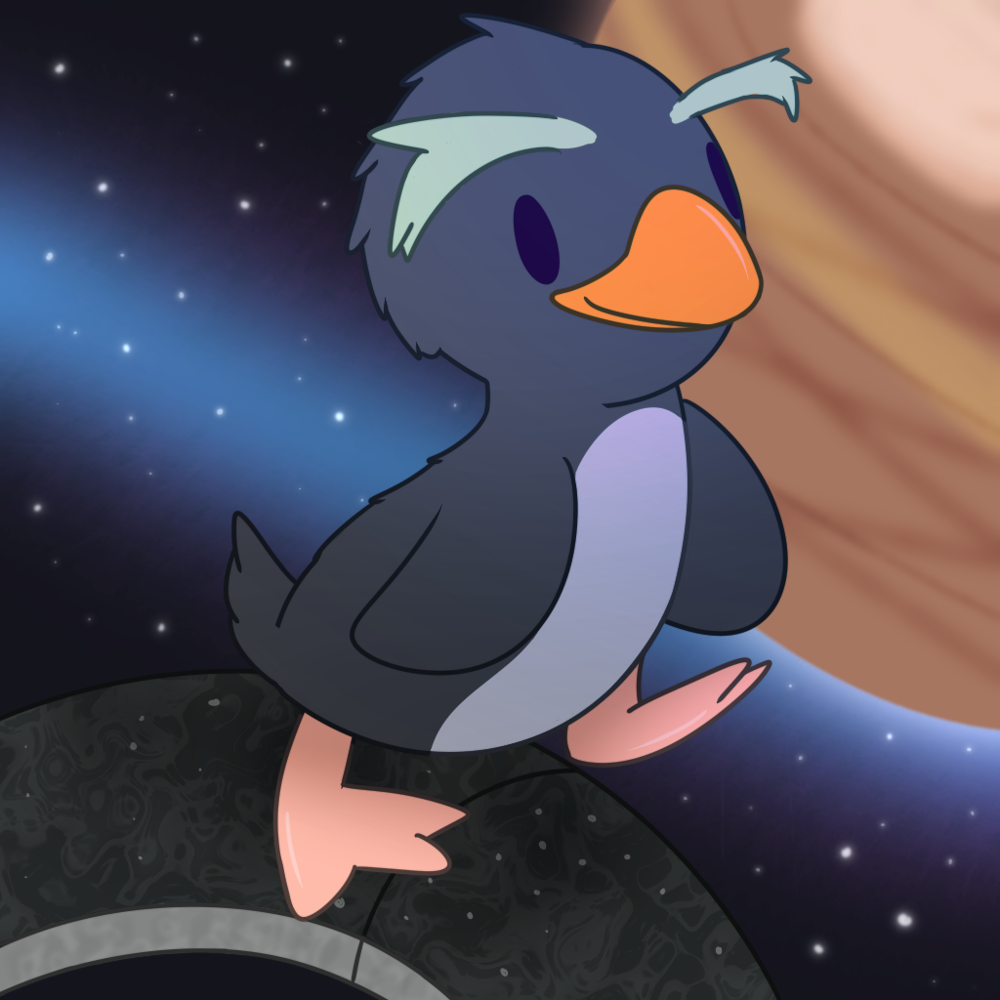

# 🐧 Ringhopper

Ringhopper is a pure-Rust library as well as a toolkit used for creating and manipulating tag data and map files for
Halo: Combat Evolved.

_(Ringhopper avatar by Snowy~)_

## Project layout

* `.gitignore` excludes build directories and common IDE and text editor configurations from source control
* `Cargo.toml` and `Cargo.lock` are build manifests
* `COPYING` is a copy of version 3 of the GNU General Public License (see [License](#License))
* `ringhopper.png` is a picture of a cartoon penguin
* `src` contains the main source code

### Libraries

* `src/ringhopper` - This is where the main, high level tag processing code is located. This contains the following:
    * Processing code for creating assets such as new tags from data
    * Calculation for physics, etc.
* `src/ringhopper-definitions` - This is the crate containing the definitions, as well as a parsed version of these
  definitions, which is used by `ringhopper-structs-codegen` for generating Rust code.
* `src/ringhopper-primitives` - This is where low-level structure processing code exists. This contains the following:
    * Tag groups
    * Definitions for primitives such as vectors, colors, planes, etc. used to make up a tag
    * Processing code for manipulating primitives
    * Processing code for parsing structures
    * Processing code for parsing tag files
* `src/ringhopper-structs` - This crate contains the actual structs, as well as some useful implementation code.
* `src/ringhopper-structs-codegen` - This is the code for generating Rust code for the definitions.

### Binaries (planned)

* `src/emperor` - This is where the graphical user interface is located. This gives an interface suitable for mouse and
  keyboard usage, including a tag and scenario editor.
* `src/invader` - This is where the command-line shell code is located. This is to provide a high quality command-line
  interface for users to maximize productivity.

### Additional projects (planned)

* `nighthawk` - This provides a native GUI frontend for Ringhopper, with a similar featureset to `emperor` except that
  it does not contain a scenario editor. This project is not included in this repository, as it is written in C++ and
  requires different build tools.

## License

The Ringhopper project is licensed under version 3 of the GNU General Public License as published by the Free Software
Foundation. This project is not licensed under any other version of this license (e.g. it is not licensed under GPLv2 or
a potential GPLv4, GPLv3.1, etc. unless all contributor(s) agree), nor under any other license (e.g. MIT, BSD, etc.).

See [COPYING](COPYING) for a copy of the license.

### Content made with Ringhopper

A common myth perpetuated in CE's modding history is that the copyright belongs to the people who made the tools. This
should go without saying, but video game assets (i.e. tags) and maps created with Ringhopper are not subject to
Ringhopper's licensing. They belong to their respective copyright holders.

First, this means that any original content that you make by yourself belongs to you. For example, if you make a model
in Blender, a texture for the model in GIMP or Photoshop, and the tags with Invader, all done from scratch, then you own
all of these assets.

However, if you choose to use, modify, or derive pre-existing content, including with tag extraction, then this content
may still belong to its original owner(s). The GPL is not magic: it doesn't give you any right to use or modify existing
content, including content supplied by official releases of the game or their respective modding tools.

For example, the usage of MCC's officially released maps or tags to make content would be bound by the MCC EULA.
Additionally, any cache files you create with Ringhopper which contain those tags would also be bound by that license
agreement. This is not a condition of using Ringhopper, and thus it is not a GPL license incompatibility. This is a
condition of using those tags.
